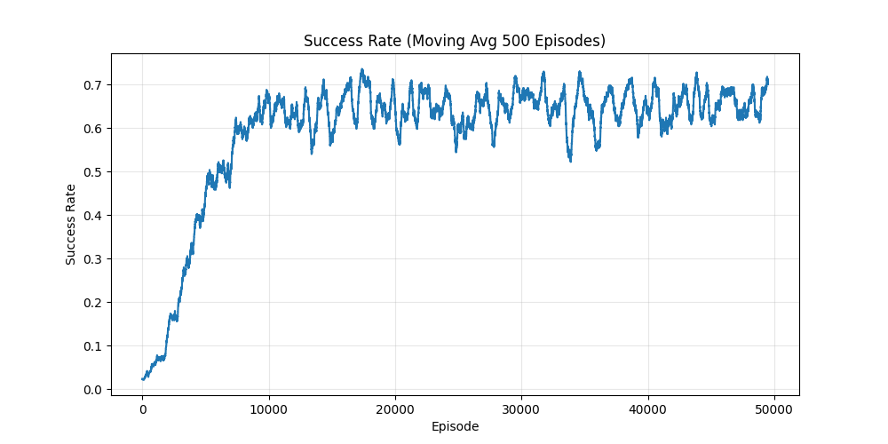
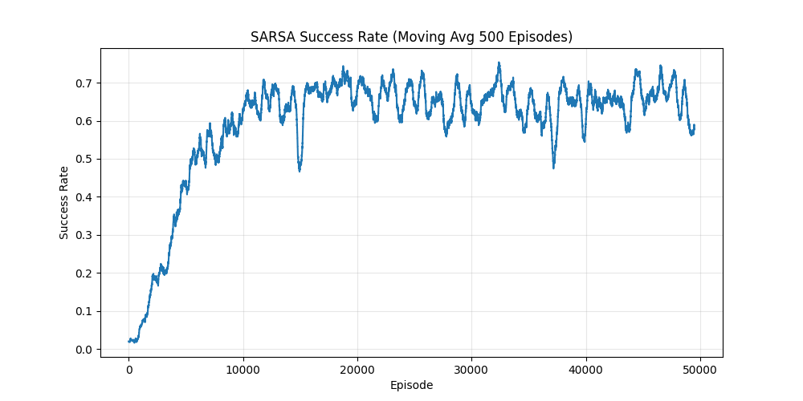
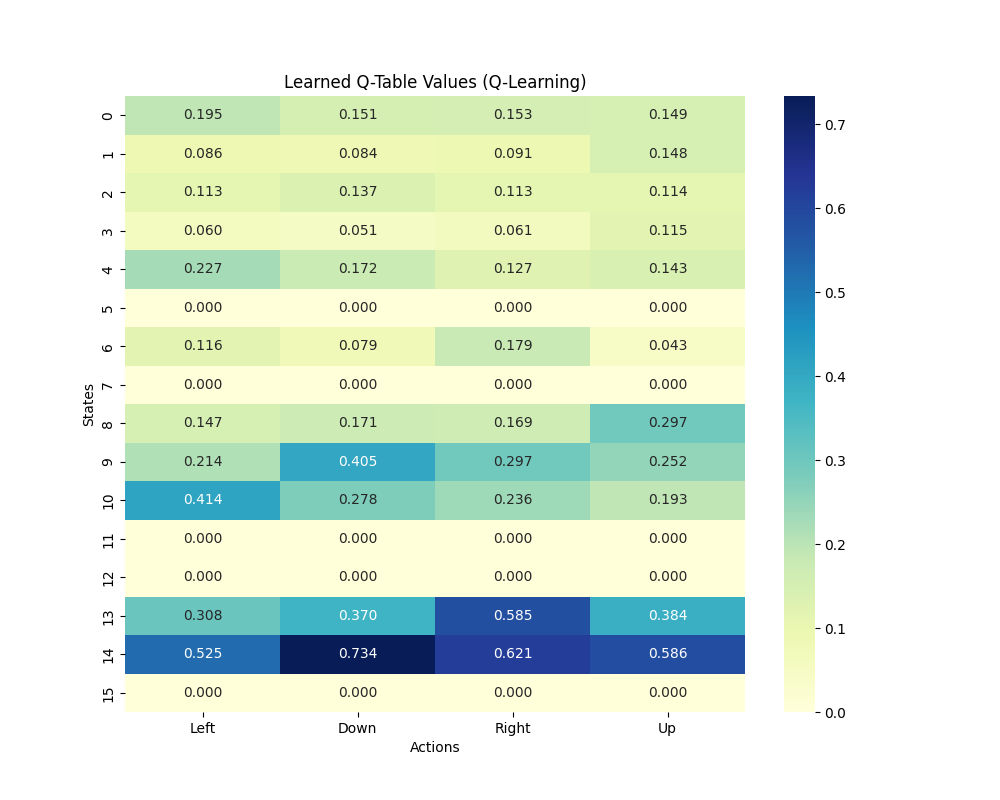
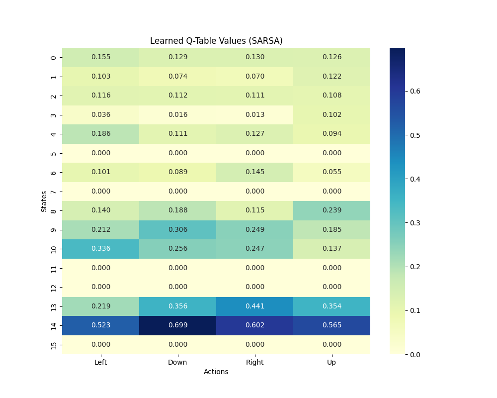

# Frozen Lake Reinforcement Learning (DQN-Style)

This repository contains professional-grade implementations of **Q-Learning** and **SARSA** algorithms applied to the `FrozenLake-v1` environment from OpenAI Gymnasium. The codebase is structured to match the architectural style of high-level Deep Q-Network (DQN) scripts, featuring modular training/deployment methods and persistent data storage.

## Project Overview

The goal is to navigate a 4x4 grid (Frozen Lake) from the Start (S) to the Goal (G) while avoiding Holes (H). The environment is set to `is_slippery=True`, meaning the agent doesn't always move in the intended direction, adding a stochastic layer to the reinforcement learning challenge.

### Core Features
- **Modular Architecture:** Separate `train()` and `deploy()` functions for high-speed computation vs. human-mode visualization.
- **Hardware Parity:** Structured with device-check logic (CPU/MPS/CUDA) consistent with research-level RL workflows.
- **Persistent Storage:** - `.npy` files store the trained Q-Tables (The Agent's "Brain").
  - `.npz` files store the training rewards history for performance analysis.
- **Visualization:** Automatic generation of smoothed success rate curves and Q-Table heatmaps.

---

## Performance Comparison

Comparing the success rate (moving average) shows how each algorithm converges. While Q-Learning often converges toward the optimal path faster, SARSA's on-policy nature typically results in a "safer" learning curve.

| Q-Learning Success Rate | SARSA Success Rate |
| :---: | :---: |
|  |  |


---

## Q-Table Visualization

The heatmaps below visualize the learned Q-values for each of the 16 states across the 4 possible actions (Left, Down, Right, Up). 

- **Q-Learning (Off-Policy):** Learns based on the maximum possible future reward, often leading to more aggressive pathfinding.
- **SARSA (On-Policy):** Updates based on the actual action taken, which often results in learning a more conservative path that stays further away from holes.

| Q-Learning Heatmap | SARSA Heatmap |
| :---: | :---: |
|  |  |


---

## Getting Started

### Prerequisites
- Python 3.10+
- Gymnasium
- NumPy, Matplotlib, Seaborn

### Installation
1. Clone the repository:
   ```bash
   git clone [https://github.com/FadiAlMahamid/Frozen-Lake-RL.git](https://github.com/FadiAlMahamid/Frozen-Lake-RL.git)
   cd Frozen-Lake-RL
